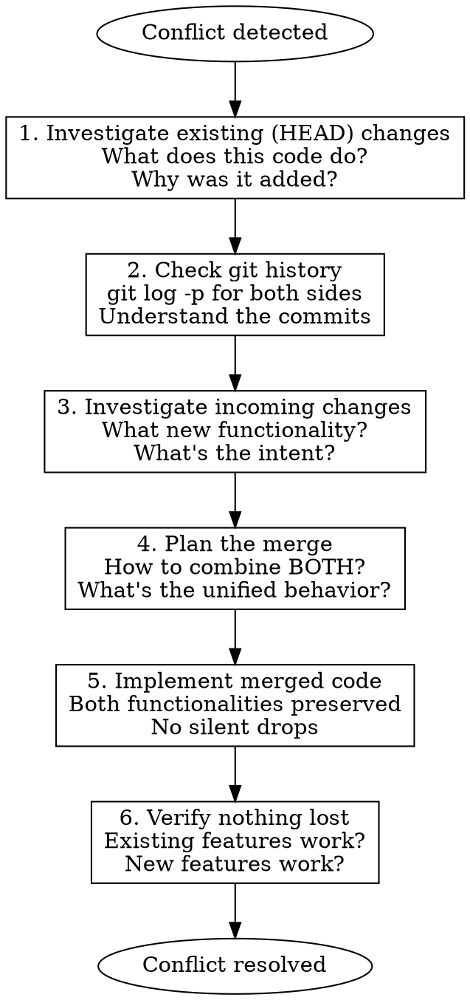

# Resolving Merge Conflicts

## Overview

Merge conflicts require **combining** both sides, not choosing one. Both the existing code (HEAD/ours) and incoming code (theirs) exist for reasons - your job is to preserve the intent and functionality of BOTH.

## The Core Problem

When resolving conflicts, there's a dangerous tendency to:
- Favor "incoming" changes as "the new/correct version"
- Treat existing changes as "old code to replace"
- Accept framing like "the feature branch has the fix"
- Skip investigating what existing code actually does

**This loses functionality.** Merge means MERGE - both sides combined.

## Required Process



### Step 1: Investigate Existing (HEAD) Changes

Before touching anything, understand what the current code does:

```bash
# See what's in the conflicting area on current branch
git show HEAD:path/to/file

# See recent commits that touched this file
git log --oneline -10 -- path/to/file

# See the actual changes in recent commits
git log -p -3 -- path/to/file
```

Ask yourself:
- What functionality does this code provide?
- Why was this added? (check commit messages)
- What would break if this code disappeared?

### Step 2: Check Git History

```bash
# See the commit being merged
git log --oneline HEAD..MERGE_HEAD -- path/to/file

# See what changed in the incoming branch
git show MERGE_HEAD:path/to/file

# Compare the two versions
git diff HEAD...MERGE_HEAD -- path/to/file
```

### Step 3: Investigate Incoming Changes

Same questions for the incoming side:
- What new functionality is being added?
- Why was this change made?
- What's the intent behind this code?

### Step 4: Plan the Merge

Now think about how to combine BOTH:
- What's the unified behavior that includes both?
- Are there any actual conflicts in logic (rare)?
- How do the two features interact?

### Step 5: Implement

Write code that preserves BOTH functionalities. This often means:
- Keeping imports from both sides
- Keeping struct fields from both sides
- Combining function logic (not replacing)
- Preserving error handling, logging, validation from both

### Step 6: Verify

Before committing, verify:
- All existing functionality still works
- All new functionality works
- No silent drops of features

## Red Flags - STOP If You Think:

| Thought | Reality |
|---------|---------|
| "The incoming changes are the correct version" | Both versions are correct for their purposes. MERGE them. |
| "The feature branch has the fix" | It has A fix. HEAD may have OTHER fixes. Combine them. |
| "This is just replacing old code" | Old code exists for a reason. Investigate before removing. |
| "I'll just take the incoming changes" | That's not merging. That's discarding work. |
| "The existing code looks outdated" | Functionality isn't outdated. Preserve it. |
| "I need to resolve this quickly" | Quick resolutions lose functionality. Take time to investigate. |

## Example: Wrong vs Right

**WRONG** (loses existing functionality):
```
The feature branch has the proper JSON response format.
I'll use the incoming changes and remove the old logging code.
```

**RIGHT** (preserves both):
```
Existing code adds: request logging, timing, rate limiting
Incoming code adds: JSON response format, Response struct

Merged solution needs ALL of:
- Request logging (from existing)
- Timing measurement (from existing)
- Rate limiting check (from existing)
- JSON response format (from incoming)
- Response struct (from incoming)
```

## Common Merge Patterns

### Both Add Fields to Struct
Keep ALL fields from both sides.

### Both Modify Same Function
Combine the logic - usually one adds validation/logging, other adds new behavior. Keep both.

### Both Add Imports
Keep all imports (remove duplicates).

### Conflicting Logic (Rare)
If the two sides genuinely contradict (different behavior for same case), ask the user which behavior is intended.

## The Bottom Line

**Merge = Combine, not Choose.**

If your resolution removes ANY functionality that existed before the merge, you've done it wrong. Go back and investigate what you're removing.
